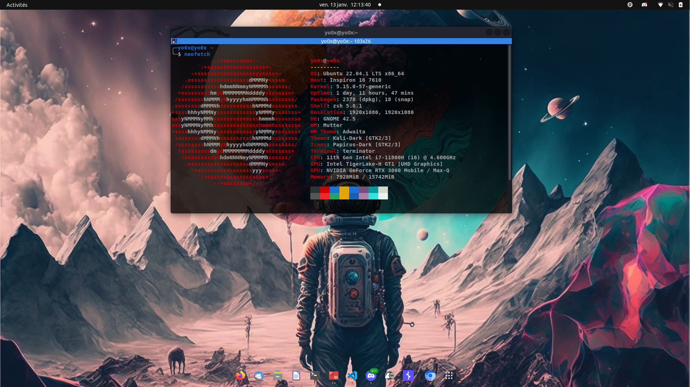

<p align="center">
    My dotfiles repository and installation scripts.
    <br>
    
    <a href="https://twitter.com/intent/follow?screen_name=YoOx15" title="Follow"></a>
    <br>
</p>

## Installation

```sh
#step 1
wget https://raw.githubusercontent.com/Y00x/dotfiles/main/omz-install.sh -O /tmp/omz-install.sh && chmod +x /tmp/omz-install.sh && /tmp/omz-install.sh
#step 2
wget https://raw.githubusercontent.com/Y00x/dotfiles/main/install.sh -O /tmp/install.sh && chmod +x /tmp/install.sh && sudo /tmp/install.sh
```

## Softwares

<center>

| Software name | Description |
|:-------------:|:-----------:|
| build-essential ||
| cutter ||
| IDA Free ||
| discord ||
| gnome-tweaks ||                
| feh ||
| ffmpeg ||
| gdb-gef | GNU debugger |
| git ||
| imagemagick ||
| terminator | Terminal emulator |
| lxappearance ||
| nmap | Network enumeration tool |
| notepadqq ||
| neofetch ||
| htop ||
| docker ||
| postman ||
| python2 ||
| python3 ||
| checksec ||
| radare2 | cli decompileur and debugger |
| spotify ||
| vim | cli text editor |
| vscode ||
| wireshark | Network and dump analyzer |
| xclip ||
| ltrace ||
| remmina | Remote desktop client |
| gqrx | radio tool analyzer | 
| gnu-radio | radio tool treatment |
| inspectrum | radio tool signal viewer |
| urh | Universal radio hacker | 
| audacity ||
| exiftool | metadata image viewer |
| binwalk ||
| foremost ||
| ffuf | Web fuzzer|
| gobuster ||
| Exegol | https://github.com/ThePorgs/Exegol |  
| Metasploit || 
| keepassxc ||


</center>

## Themes

<center>

| Themes name | Description |
|:-------------:|:-----------:|
| Kali-Dark | Kali-Dark application themes|
| Papirus | Icon Themes |
| Oh-my-zsh ||
| OMZ bira | Oh-my-zsh themes |
| Terminator personal themes ||


</center>

## Browser extensions

<center>

| Extension name | Description |
|:--------------:|:-----------:|
| [Always clear my downloads](https://chrome.google.com/webstore/detail/always-clear-downloads-in/efoelbbfbknfhpmgclpcdbkoieedkkai) ||
| [APK Downloader](https://chrome.google.com/webstore/detail/apk-downloader/idkigghdjmipnppaeahkpcoaiphjdccm) ||
| [Keepassxc](https://chrome.google.com/webstore/detail/keepassxc-browser/oboonakemofpalcgghocfoadofidjkkk) ||
| [Boomerang](https://chrome.google.com/webstore/detail/boomerang-soap-rest-clien/eipdnjedkpcnlmmdfdkgfpljanehloah) ||
| [Cookie editor](https://chrome.google.com/webstore/detail/cookie-editor/hlkenndednhfkekhgcdicdfddnkalmdm) ||
| [DotGit](https://chrome.google.com/webstore/detail/dotgit/pampamgoihgcedonnphgehgondkhikel) | Auto check: .git \| .svn \| .hg \| .env \| ... |
| [Markdown here](https://chrome.google.com/webstore/detail/markdown-here/elifhakcjgalahccnjkneoccemfahfoa) ||
| [Open Multi URLs](https://chrome.google.com/webstore/detail/open-multiple-urls/oifijhaokejakekmnjmphonojcfkpbbh) ||
| [ProxyFoxy](https://chrome.google.com/webstore/detail/foxyproxy-standard/gcknhkkoolaabfmlnjonogaaifnjlfnp) ||
| [retire.js](https://chrome.google.com/webstore/detail/retirejs/moibopkbhjceeedibkbkbchbjnkadmom) ||
| [Shodan](https://chrome.google.com/webstore/detail/shodan/jjalcfnidlmpjhdfepjhjbhnhkbgleap) ||
| [Temp mail](https://chrome.google.com/webstore/detail/temp-mail-disposable-temp/inojafojbhdpnehkhhfjalgjjobnhomj) ||
| [Wappalyzer](https://chrome.google.com/webstore/detail/wappalyzer-technology-pro/gppongmhjkpfnbhagpmjfkannfbllamg) ||
| [Ghostery](https://chrome.google.com/webstore/detail/ghostery-%E2%80%93-privacy-ad-blo/mlomiejdfkolichcflejclcbmpeaniij?hl=fr) ||
| [YWH VDP finder](https://chrome.google.com/webstore/detail/yeswehack-vdp-finder/jnknjejacdkpnaacfgolbmdohkhpphjb) ||
| [Hack-Tools](https://chrome.google.com/webstore/detail/hack-tools/cmbndhnoonmghfofefkcccljbkdpamhi) ||
| [HTTP-Header-Live](https://chrome.google.com/webstore/detail/live-http-headers/ianhploojoffmpcpilhgpacbeaifanid/related) ||

</center>